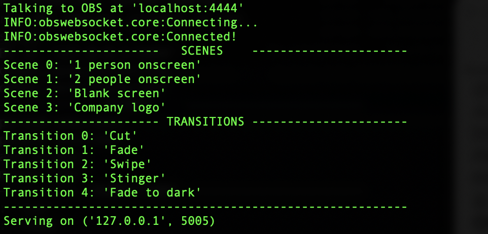
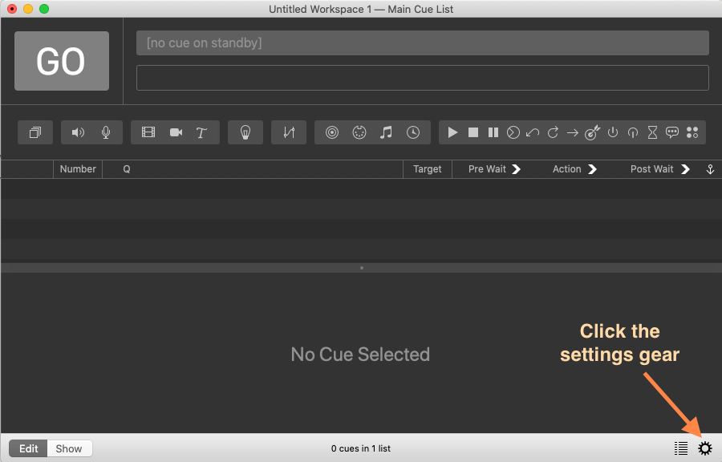
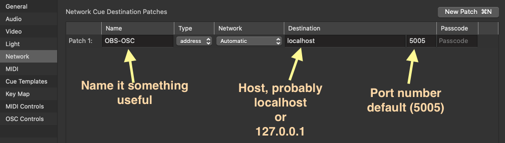
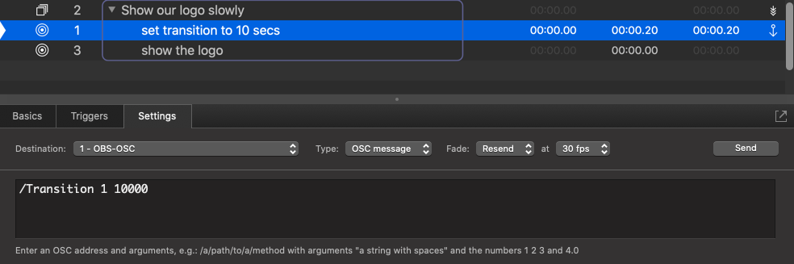
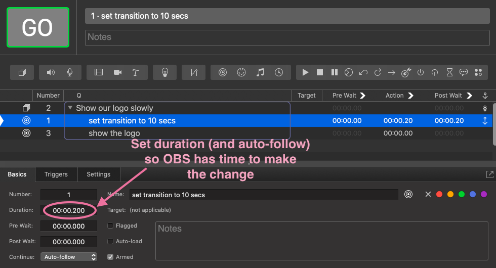
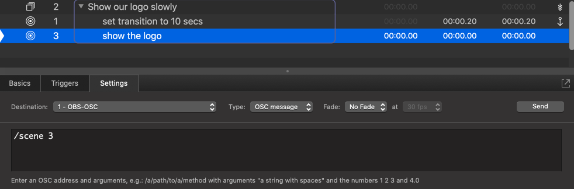

# obsosc-py
Talk to [OBS](https://obsproject.com/) via [OSC](http://opensoundcontrol.org/spec-1_0)

## Acknowledgements

I did some searching before I started modifying some code I found online. 
Here's the parts of the search that got me started.

Starting with discussion [here](https://obsproject.com/forum/threads/osc-support.83145/).
Someone mentioned [this](https://github.com/CarloCattano/ObSC) gitub repo which was helpful
sample code, but didn't work as simply as I had hoped.
Then I found [this](https://community.troikatronix.com/topic/6570/obs-osc-scene-switcher-my-version)
post which worked and was what I used as a basis for this.

## Rationale

Since the Covid pandemic started, the theatre company I work with has been doing 
Zoom radio plays. As we got more sophisticated, we wanted to have some more control
over the production so wanted to start using [OBS](https://obsproject.com/) for streaming the productions.
As I had been using QLab for years for sound and other conrols, I thought that would
be the perfect dashboard for controlling scene changes in [OBS](https://obsproject.com/). I was surprised to see
how little knowledge of OSC there was in the [OBS](https://obsproject.com/) community. Fortunately, someone
had the foresight to create a 
[websockets interface to OBS](https://obsproject.com/forum/resources/obs-websocket-remote-control-obs-studio-from-websockets.466/).
This plugin gives [comprehensive access](https://github.com/Palakis/obs-websocket/blob/4.x-current/docs/generated/protocol.md)
to all the features of OBS.
Then when I found some python examples that use the libraries that give easy python
[access to OSC](https://pypi.org/project/python-osc/) and [OBS websockets](https://github.com/Elektordi/obs-websocket-py)
so with a little [sample code](https://github.com/CarloCattano/ObSC), it was pretty simple to make some 
modifications to add features and make it work a little easier, at least for me in QLab.


## tl;dr for Mac

1. Clone this github repo
1. Have [OBS](https://obsproject.com/) running
1. Double-click `start.command`
1. Output shows the values for your scenes and transitions

(if that doesn't work, then you may need to install [python3](https://opensource.com/article/19/5/python-3-default-mac) first)

## Setup

I can only speak for Mac OS X setup as that is the only platform I have, so hopefully
someone with Windows can add some instructions and files that will make it easy
to set up there.

This python code requires packages:

* [obs-websocket-py](https://github.com/Elektordi/obs-websocket-py)
for easy access to the obs-websocket plugin
* [python-osc](https://pypi.org/project/python-osc/)
for really easy creation of an osc server

Others are listed in `requirements.txt` file.

### Mac setup

The big prerequisite here is that you have [python3](https://opensource.com/article/19/5/python-3-default-mac) 
installed and able to run the Terminal app.

On modern macs, you may have both v2 and v3 of python installed. To run python v3, you 
may simply use commands `python3` and `pip3` rather than `python` and `pip`. The scripts
that do setup and start will do some checking for python3, so it might not matter if these
scripts are working.

Here are the different ways to start the app, that should have the same result in ascending order of
work. Before doing any of these, you must

FIRST, run have [OBS](https://obsproject.com/) running on your machine, or else it will not start.

1. Simple double-click
    * Open this directory in the finder and double-click `start.command`

1. Run from command-line (runs setup automatically the first time)
    * Open Terminal
    * `cd` into this directory
    * `./start.sh`

1. Setup and then run separately
    * Open Terminal
    * `cd` into this directory
    * `./setup.sh`
    * `./start.sh`
 
You'll notice a new file appears in this directory, `_SETUP_RAN_` which just tells the startup
script that you already successfully setup the app so it won't bother trying to setup again.
If you have some reason to believe you need to setup again, you can delete that file
anytime as it's not that big a deal to setup again.

## How to use

* Begin by running [OBS](https://obsproject.com/)
* Then start [obsosc-py](https://github.com/bbernstein/obsosc-py) following instructions above

Now you can launch your [OSC](http://opensoundcontrol.org/spec-1_0) client. Personally
I am a big fan of [Qlab](https://qlab.app/)

Now you can send messages to OBS:

`/scene <scene-index>`

`/transition <transition-index> <optional-milliseconds>`

## Examples

When you first start the app, your terminal window will look something like this 
(probably with very different colors than this):



That info is important as it shows the index of each of the scenes and transitions that you'll use in your commands.

### Changing Scene

So, if I want to change the scene to "Company logo", I'll send the OCS command:

```
/scene "Company logo"
```

Alternatively, I can use the index to reference the scene. One drawback is that
if you change the order of scenes, it might not pick up the change. I recommend
using the name to reference scenes.

```
/scene 3
```


### Changing transition setting

To change the next transition to happen as a 3000 millisecond Fade, I'd send this command:

```
/transition "Fade" 3000
```

Then all my subsequent scene changes will be 3-second fades.

If I don't want to change the timing for the transition, I would just leave off that second parameter and the
new transition will continue to be whatever was last set for transition time.

```
/transition "Cut"
```

### Setting up in Qlab:


**note: The OSC commands in the screenshots below are old. I am now recommending using *names* rather than indexes for 
Scenes and Transitions. Also, all commands are *lowercase*, so instead of `/Transition 1 10000` it should be `/transition "Fade" 10000`. Also
`/scene 3` should be `/scene "Company logo`**

First set up network settings. Click the gear to see settings.



Set the Network settings so you are talking to port 5005 of localhost (or 127.0.0.1)



Make a cue to set the next transition. In this example we are setting it up to be a 10 second fade.



One extra note: if you are planning on using the transition immediately, then you should set
the duration of this cue to be at least 0.2 second so that OBS has time to make that change
before it tries to change scenes. Keep that extra time in mind if the exact timing matters.
Alternatively, you can change the transition time earlier so there's no extra
sub-second delay needed.



For the scene change cue, just give the parameter of the scene index. 
(note the first index is zero, so scene 3 is the fourth one)



